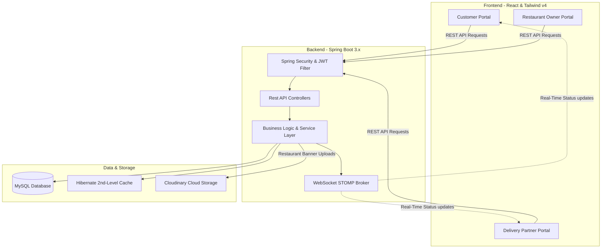

# 🍽️ Feasto: Modern Food Delivery & Platform Ecosystem

Feasto is a production-grade, full-stack food delivery platform that seamlessly connects **Customers**, **Restaurant Owners**, and **Delivery Partners** (Riders) in real-time. Built using a modern technical stack featuring **Spring Boot 3.x** on the backend and **React + Vite** with **Tailwind CSS v4** on the frontend, Feasto provides a premium, responsive user experience complete with interactive map tracking, detailed analytics, and robust role-based security.

---

## 🏛️ System Architecture

Feasto is designed as a decoupled multi-portal system that coordinates workflows across three main application roles:



---

## ✨ Core Features by User Role

### 1. 😋 Customer Portal
* **Browse & Search:** Discover registered local restaurants with dynamic filtering by cuisine, rating, and status.
* **Smart Menu Ordering:** Browse restaurant-specific menus, configure item quantities, and place orders.
* **Loyalty Program:** Dual-membership tier (**BASIC** vs. **GOLD**) that rewards users with points and perks.
* **Live Order Tracking:** Track deliveries interactively on a live Leaflet map.
* **Payment Methods:** Support for Card, UPI, Net Banking (Online simulation), and Cash on Delivery (COD).

### 2. 🍳 Restaurant Owner Portal
* **Dashboard Analytics:** Visual overview of business health, order volume, revenue metrics, and ratings using **ApexCharts**.
* **Menu Management:** Add, edit, or remove menu items, adjust prices, descriptions, and instantly toggle dish availability.
* **Order Management:** View incoming orders and transition their state in real-time (`ACCEPTED` ➡️ `PREPARING` ➡️ `ASSIGNED`).
* **Profile Management:** Edit restaurant banner images (backed by Cloudinary), operational hours, and address locations.

### 3. 🚴 Delivery Partner (Rider) Portal
* **Rider Dashboard:** View daily earnings, active deliveries, and delivery statistics.
* **Job Assignment:** View and accept active deliveries waiting in the local queue.
* **Interactive Routing:** Navigation showing routes from the restaurant pickup point to the customer's delivery address using **Leaflet Routing Machine**.
* **Real-time Updates:** Push notifications and order status transitions (`OUT_FOR_DELIVERY` ➡️ `DELIVERED`).

---

## 🛠️ Technology Stack

### Backend (`Feasto-be`)
* **Framework:** Spring Boot 3.5.6 (Java 17)
* **Security:** Spring Security & Stateless JWT Authentication
* **Database & Persistence:** Hibernate, Spring Data JPA, MySQL 8
* **Caching:** Hibernate 2nd Level Cache (JCache & Ehcache 3) to optimize query performance
* **Media Storage:** Cloudinary integration for high-performance image hosting
* **Real-time Messaging:** WebSockets with STOMP messaging protocol
* **Documentation:** OpenAPI 3 / Swagger UI (`springdoc-openapi`)
* **Utilities:** Lombok, ModelMapper, JSR-380 validation (`jakarta.validation`)

### Frontend (`Feasto-fe`)
* **Core Library:** React 18 (Vite, ES Modules, Fast Refresh)
* **Styling:** Tailwind CSS v4 (Sleek layout design, responsive flex/grid)
* **State Management:** Redux Toolkit & React Redux
* **Routing:** React Router DOM v6
* **Maps & Tracking:** Leaflet, React Leaflet, and Leaflet Routing Machine
* **Charts:** ApexCharts & React ApexCharts
* **Network Requests:** Axios with Request/Response interceptors
* **Notifications:** React Toastify for rich micro-interactions

---

## 📂 Repository Structure

```directory
Feasto/
├── Feasto-be/                      # Spring Boot Maven backend application
│   ├── src/main/java/com/feasto/
│   │   ├── config/                 # Security, CORS, Swagger, and WebSocket configuration
│   │   ├── controller/             # REST endpoints (User, Order, Restaurant, etc.)
│   │   ├── dto/                    # JSR-380 validated data transfer objects
│   │   ├── entity/                 # Database entity mappings (User, Restaurant, Order, etc.)
│   │   ├── enums/                  # Core application enum types (Role, OrderStatus, etc.)
│   │   ├── exception/              # Global custom exception handling framework
│   │   ├── repository/             # Spring Data JPA repositories
│   │   └── service/                # Business logic, Cloudinary uploads, cache management
│   ├── src/main/resources/
│   │   ├── application.properties  # Database, JWT, and Cloudinary settings
│   │   └── ehcache.xml             # Hibernate second-level cache configuration
│   └── pom.xml                     # Maven dependencies file
├── Feasto-fe/                      # React SPA Vite frontend application
│   ├── src/
│   │   ├── assets/                 # Fonts, logo resources, and static images
│   │   ├── components/             # Reusable UI widgets and custom layout wrappers
│   │   ├── pages/                  # Route-level screens (auth, customer, restaurant, delivery)
│   │   ├── services/               # Axios API client, authentication helper functions
│   │   ├── store/                  # Redux slices (auth, order status, configuration)
│   │   ├── utils/                  # Coordinate formulas, formatting helpers
│   │   └── App.jsx                 # Routes declarations and Protected Route middleware
│   ├── package.json                # Frontend dependencies and npm scripts
│   └── vite.config.js              # Vite bundler configurations
└── README.md                       # Documentation overview (This file)
```

---

## 🚀 Getting Started

### Prerequisites
* **Java Development Kit (JDK) 17** or higher
* **Node.js** (v18 or higher) & **npm**
* **MySQL Server** (running locally or in a cloud instance)
* **Cloudinary Account** (Free tier is sufficient for image hosting)

---

### 1. Database Setup
Create a schema named `feasto` in your MySQL server:
```sql
CREATE DATABASE feasto;
```

---

### 2. Configure Backend Credentials
Open `Feasto-be/src/main/resources/application.properties` and customize the database connection, JWT signing secret, and Cloudinary configurations:

```properties
# Database Configuration
spring.datasource.url=jdbc:mysql://localhost:3306/feasto?createDatabaseIfNotExist=true
spring.datasource.username=YOUR_MYSQL_USERNAME
spring.datasource.password=YOUR_MYSQL_PASSWORD

# Security & JWT Configuration
feasto.jwt.secret=YOUR_JWT_SIGNING_SECRET_KEY
feasto.jwt.expiration=86400000

# Cloudinary Integration (Image Uploads)
cloudinary.cloud_name=YOUR_CLOUDINARY_CLOUD_NAME
cloudinary.api_key=YOUR_CLOUDINARY_API_KEY
cloudinary.api_secret=YOUR_CLOUDINARY_API_SECRET
```

---

### 3. Run the Backend Server
Navigate to the backend directory and compile/start the application using Maven:

```bash
cd Feasto-be
# Using Maven Wrapper (Windows)
.\mvnw.cmd spring-boot:run

# Using Maven Wrapper (macOS/Linux)
./mvnw spring-boot:run
```
The server will run on `http://localhost:8080` with API context path `/api`.
* **Swagger Documentation URL:** `http://localhost:8080/api/swagger-ui.html`

---

### 4. Run the Frontend Application
Navigate to the frontend directory, install dependencies, and launch the Vite development server:

```bash
cd Feasto-fe
npm install
npm run dev
```
The application will launch on `http://localhost:5173`. Open this URL in your browser to begin exploring!

---

## 🔒 Security & Data Integrity Highlights

* **Cross-Role Email Uniqueness Validation:** To prevent security collisions and authentication errors, the registration process runs strict, case-insensitive email existence checks across all Customer, Restaurant, and Rider tables.
* **Safe Image Upload Pipeline:** Registration forms validate file constraints before initiating connection pipelines to Cloudinary, reducing latency and avoiding dangling uploads.
* **Granular Role Guards:** Frontend endpoints utilize React Protected Routes based on JWT-decoded role contexts. The API enforces method-level route controls, securing database manipulation endpoints from unauthorized access.
