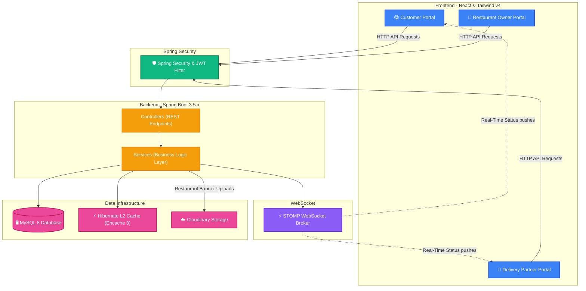

<h1 align="center">🍕 Feasto — Production-Grade Food Delivery Platform & Ecosystem</h1>

<p align="center">
  A premium, decoupled multi-portal food delivery ecosystem connecting Customers, Restaurant Owners, and Delivery Partners in real-time. Built using Spring Boot 3.5.6 (Java 17), Hibernate, React 18, and Tailwind CSS v4.
</p>

<p align="center">
  <a href="https://github.com/SurajKarande01/feasto/stargazers"></a>
  <a href="https://github.com/SurajKarande01/feasto/network/members"></a>
  <a href="https://github.com/SurajKarande01/feasto/issues"></a>
  <a href="https://github.com/SurajKarande01/feasto/pulls"></a>
</p>

---

## ✨ Key Features by User Role

Feasto is built around three distinct user roles, each featuring a dedicated portal with custom-designed workflows and features:

| 😋 Customer Portal | 🍳 Restaurant Owner Portal | 🚴 Delivery Partner (Rider) Portal |
| :--- | :--- | :--- |
| 🔍 **Browse & Search**<br>Discover restaurants with dynamic filtering by cuisine, ratings, and open status. | 📊 **Business Analytics**<br>Visual insights on revenue, order volume, and rating trends with ApexCharts. | 💰 **Earnings & Stats**<br>Track daily earnings, active deliveries, and historical delivery stats. |
| 🛒 **Smart Menu & Cart**<br>Browse menus, configure item quantities, and place orders instantly. | 🍽️ **Menu Management Engine**<br>Manage dishes: add/edit items, adjust prices, descriptions, and toggle availability. | 📋 **Job Dispatch Queue**<br>View and accept pending orders from the live neighborhood dispatch system. |
| 🎖️ **Loyalty Program**<br>Earn perks with a dual membership tier (Basic vs. Gold membership tiers). | 📦 **Order Orchestration**<br>Transition live order states in real-time (`ACCEPTED` ➡️ `PREPARING` ➡️ `ASSIGNED`). | 🗺️ **Interactive Routing**<br>Real-time navigation mapping from restaurant to customer via Leaflet Routing Machine. |
| 📍 **Live Order Tracking**<br>Track delivery riders in real-time on an interactive Leaflet map. | ☁️ **Brand Profile**<br>Upload banners (Cloudinary), configure operational hours, and map locations. | ⚡ **Status Transitions**<br>Trigger updates in real-time (`OUT_FOR_DELIVERY` ➡️ `DELIVERED`). |

---

## 🏛️ System Architecture

Feasto is designed as a decoupled multi-portal system that coordinates workflows across three main application roles, using secure REST APIs, real-time messaging, and high-performance caching:



---

## 🛠️ Enterprise Tech Stack

Feasto leverages modern, industry-standard tools to deliver a secure, scalable, and responsive ecosystem.

### ⚙️ Backend (`Feasto-be`)
<p align="left">
  <a href="https://spring.io/projects/spring-boot"></a>
  <a href="https://spring.io/projects/spring-security"></a>
  <a href="https://www.mysql.com"></a>
  <a href="https://hibernate.org"></a>
  <a href="https://ehcache.org"></a>
  <a href="https://cloudinary.com"></a>
  <a href="https://swagger.io"></a>
  <a href="https://projectlombok.org"></a>
</p>

* **Caching Engine:** Ehcache 3 integrated as a Hibernate Second-Level Cache to bypass redundant database lookups for menus and restaurants.
* **WebSocket STOMP Broker:** Establishes full-duplex communication channels to sync order status and rider geolocations in real-time.
* **Data Validation:** Strict JSR-380 validation (`jakarta.validation`) on incoming request payloads.

### 🖥️ Frontend (`Feasto-fe`)
<p align="left">
  <a href="https://react.dev"></a>
  <a href="https://vite.dev"></a>
  <a href="https://tailwindcss.com"></a>
  <a href="https://redux-toolkit.js.org"></a>
  <a href="https://leafletjs.com"></a>
  <a href="https://apexcharts.com"></a>
  <a href="https://axios-http.com"></a>
</p>

* **State Syncing:** Redux Toolkit orchestrates state management for authentication contexts, local order carts, and WebSocket sessions.
* **Mapping & Routing:** Leaflet paired with Leaflet Routing Machine calculates paths and animates riders along delivery routes.
* **Data Visualizations:** ApexCharts displays real-time earnings, rating distributions, and operational volume for restaurant owners.

---

## 📁 Codebase Anatomy

```directory
Feasto/
├── 📂 Feasto-be/                      # Spring Boot Maven Backend Application
│   ├── 📂 src/main/java/com/feasto/
│   │   ├── 📁 config/                 # Security, CORS, Swagger, and WebSocket configuration
│   │   ├── 📁 controller/             # REST endpoints (User, Order, Restaurant, etc.)
│   │   ├── 📁 dto/                    # JSR-380 validated data transfer objects
│   │   ├── 📁 entity/                 # Database entity mappings (User, Restaurant, Order, etc.)
│   │   ├── 📁 enums/                  # Core application enum types (Role, OrderStatus, etc.)
│   │   ├── 📁 exception/              # Global custom exception handling framework
│   │   ├── 📁 repository/             # Spring Data JPA repositories
│   │   └── 📁 service/                # Business logic, Cloudinary uploads, cache management
│   ├── 📂 src/main/resources/
│   │   ├── 📄 application.properties  # Database, JWT, and Cloudinary settings
│   │   └── 📄 ehcache.xml             # Hibernate second-level cache configuration
│   └── 📄 pom.xml                     # Maven dependencies file
└── 📂 Feasto-fe/                      # React SPA Vite Frontend Application
    ├── 📂 src/
    │   ├── 📁 assets/                 # Fonts, logo resources, and static images
    │   ├── 📁 components/             # Reusable UI widgets and custom layout wrappers
    │   ├── 📁 pages/                  # Route-level screens (auth, customer, restaurant, delivery)
    │   ├── 📁 services/               # Axios API client, authentication helper functions
    │   ├── 📁 store/                  # Redux slices (auth, order status, configuration)
    │   ├── 📁 utils/                  # Coordinate formulas, formatting helpers
    │   └── 📄 App.jsx                 # Routes declarations and Protected Route middleware
    ├── 📄 package.json                # Frontend dependencies and npm scripts
    └── 📄 vite.config.js              # Vite bundler configurations
```

---

## 🚀 Installation & Local Setup

Follow these steps to configure your local development environment.

### 📋 Prerequisites
* **Java Development Kit (JDK) 17** or higher
* **Node.js** (v18 or higher) & **npm**
* **MySQL Server** (running locally or in a cloud instance)
* **Cloudinary Account** (Free tier is sufficient for image hosting)

---

### 🗄️ Step 1: Database Setup
Launch your MySQL terminal or GUI (like Workbench or DBeaver) and create the project database:
```sql
CREATE DATABASE feasto;
```

---

### 🔑 Step 2: Configure Environment Settings
Open `Feasto-be/src/main/resources/application.properties` and customize the database connection, JWT signing secret, and Cloudinary configurations:

```properties
# Database Configuration
spring.datasource.url=jdbc:mysql://localhost:3306/feasto?createDatabaseIfNotExist=true
spring.datasource.username=YOUR_MYSQL_USERNAME
spring.datasource.password=YOUR_MYSQL_PASSWORD

# Security & JWT Configuration
feasto.jwt.secret=YOUR_JWT_SIGNING_SECRET_KEY
feasto.jwt.expiration=86400000

# Cloudinary Integration (Image Uploads)
cloudinary.cloud_name=YOUR_CLOUDINARY_CLOUD_NAME
cloudinary.api_key=YOUR_CLOUDINARY_API_KEY
cloudinary.api_secret=YOUR_CLOUDINARY_API_SECRET
```

> [!WARNING]
> Do not commit raw passwords or secrets to public repositories. Ensure that production secrets are loaded through environment variables.

---

### ⚙️ Step 3: Run the Services

#### ☕ Running the Backend Server
Navigate to the backend directory and compile/start the application using Maven:
```bash
cd Feasto-be

# Using Maven Wrapper (Windows)
.\mvnw.cmd spring-boot:run

# Using Maven Wrapper (macOS/Linux)
./mvnw spring-boot:run
```
> [!NOTE]
> The backend server boots at `http://localhost:8080` with API context path `/api`.
> You can access the live Swagger UI playground at: [http://localhost:8080/api/swagger-ui.html](http://localhost:8080/api/swagger-ui.html)

#### ⚛️ Running the Frontend Server
Navigate to the frontend directory, install dependencies, and launch the Vite development server:
```bash
cd Feasto-fe
npm install
npm run dev
```
> [!TIP]
> The application will launch on `http://localhost:5173`. Open this URL in your browser to begin exploring!

---

## 🎛️ Local Development Cheat Sheet

| Task | Category | Command |
| :--- | :--- | :--- |
| **Run Backend Dev** | Backend | `.\mvnw.cmd spring-boot:run` |
| **Build Backend JAR** | Backend | `.\mvnw.cmd clean package` |
| **Run Backend JAR** | Backend | `java -jar target/feasto-backend.jar` |
| **Install Dependencies**| Frontend | `npm install` |
| **Run Frontend Dev** | Frontend | `npm run dev` |
| **Build Frontend Prod**| Frontend | `npm run build` |

---

## 🔒 Security & Data Integrity Highlights

* **🛡️ Cross-Role Email Uniqueness Validation:** To prevent security collisions and authentication errors, the registration process runs strict, case-insensitive email existence checks across all Customer, Restaurant, and Rider tables.
* **☁️ Safe Image Upload Pipeline:** Registration forms validate file constraints (size and content-type) before initiating connection pipelines to Cloudinary, reducing server latency and avoiding dangling uploads.
* **🔑 Granular Role Guards:** Frontend endpoints utilize React Protected Routes based on JWT-decoded role contexts. The API enforces method-level route controls (`@PreAuthorize`), securing database manipulation endpoints from unauthorized access.
* **🔄 Session Integrity:** Session checking decodes role claims to dynamically build navigation layout dashboards matching the user's role.

---

## 🧑‍💻 Author

<p align="center">
  <strong>Suraj Karande</strong><br/>
  <a href="https://github.com/SurajKarande01"></a>
  <a href="https://linkedin.com/in/suraj-karande"></a>
</p>
